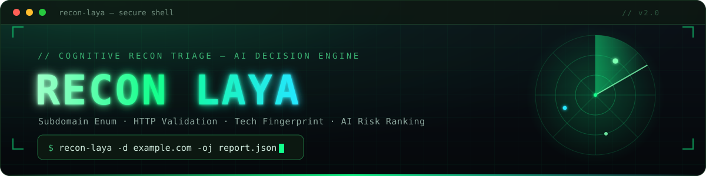
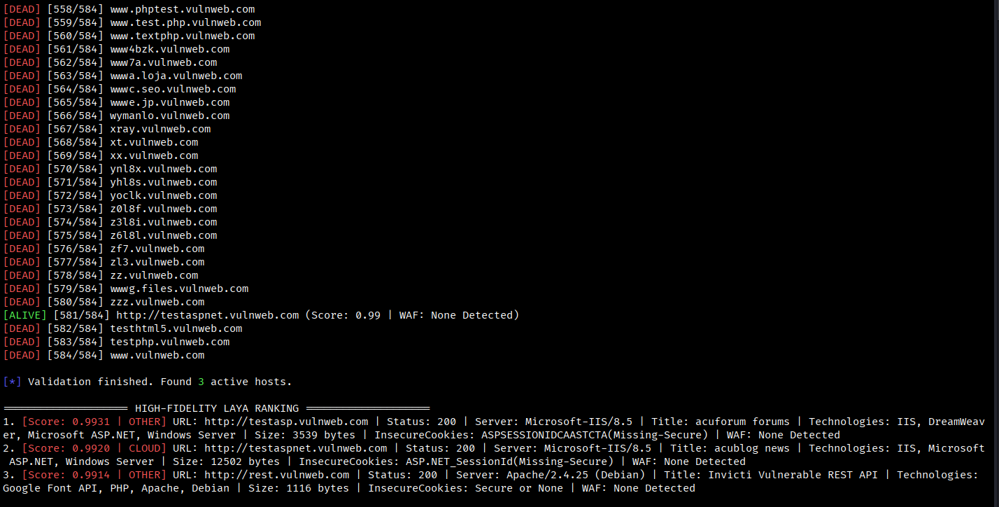

# Recon Laya - Cognitive Recon Triage with AI Decision Engine

[](https://python.org)
[](LICENSE)
[](Dockerfile)

<p align="center">
  
</p>

> **Recon Laya** é um toolkit de reconhecimento web cognitivo que combina enumeração passiva de subdomínios, validação HTTP ativa, fingerprinting de tecnologias (Wappalyzer) e um motor de decisão baseado em IA (Laya) para triagem e priorização automática de alvos por criticidade/risco.

## 🎯 Principais Funcionalidades

- **Enumeração Multi-Fonte**: crt.sh, CertSpotter, RapidDNS, HackerTarget, Anubis, OTX, VirusTotal, SubdomainCenter, DNSDumpster, BufferOver.run, Digitorus
- **Execução Paralela**: Coleta de subdomínios e validação HTTP concorrentes (configurável)
- **Fingerprinting Avançado**: Wappalyzer (tech stack + versões), detecção de WAF, análise de cookies, headers
- **Triagem Cognitiva (IA)**: Modelo Laya local (GGUF) ranqueia alvos por score de risco (0.0-1.0) e classifica vetor de ataque (api, cms, login, cloud, other)
- **Saídas Estruturadas**: JSON e Markdown para relatórios e automação
- **Pipeline-Friendly**: Aceita entrada via stdin para encadeamento com outras ferramentas
- **100% Local**: Sem dependência de APIs externas, modelo roda via llama.cpp backend

## 📋 Pré-requisitos

- Python 3.10+
- Docker (opcional, para execução containerizada)

## 🚀 Instalação Rápida

### Via Docker (Recomendado)

```bash
# Clone o repositório
git clone https://github.com/seu-usuario/recon-llama-laya.git
cd recon-llama-laya

# Build da imagem
docker build -t recon-laya .

# Executar
docker run --rm --network host -v $(pwd)/outputs:/tmp/outputs \
  recon-laya -d example.com -oj /tmp/outputs/report.json -om /tmp/outputs/report.md
```

### Via Python (Desenvolvimento)

```bash
# Clone e entre no diretório
git clone https://github.com/seu-usuario/recon-llama-laya.git
cd recon-llama-laya

# Crie ambiente virtual
python3 -m venv .venv
source .venv/bin/activate

# Instale dependências
pip install -r requirements.txt

# Execute
python3 recon-tactical-laya2.py -d example.com -oj outputs/report.json -om outputs/report.md
```

## 📖 Uso

```bash
# Ajuda
python3 recon-tactical-laya2.py --help

# Enumeração passiva + triagem ativa (domínio)
python3 recon-tactical-laya2.py -d example.com

# Pipeline com lista de subdomínios
cat subdomains.txt | python3 recon-tactical-laya2.py

# Gerar relatórios
python3 recon-tactical-laya2.py -d example.com -oj report.json -om report.md

# Com Docker
docker run --rm --network host -v $(pwd)/outputs:/tmp/outputs \
  recon-laya -d example.com -oj /tmp/outputs/report.json -om /tmp/outputs/report.md
```

### Argumentos

| Flag | Descrição |
|------|-----------|
| `-d, --domain` | Domínio alvo para enumeração passiva via CT logs |
| `-oj, --output-json` | Caminho para salvar relatório JSON |
| `-om, --output-md` | Caminho para salvar relatório Markdown |
| `stdin` | Lista de subdomínios (um por linha) via pipe |

## 🧠 Como Funciona

```
1. Enumeração Passiva (Paralela)
   ├── crt.sh (CT Logs JSON + HTML)
   ├── CertSpotter API
   ├── RapidDNS
   ├── HackerTarget
   ├── Anubis DB
   ├── AlienVault OTX
   ├── VirusTotal (público)
   ├── SubdomainCenter
   ├── DNSDumpster
   ├── BufferOver.run
   └── Digitorus

2. Validação Ativa (20 threads)
   ├── HTTP/HTTPS com User-Agent rotativo
   ├── Timeout 4s, SSL verification disabled
   ├── Extração: Title, Server, Tech Stack, WAF, Cookies, Content-Length

3. Classificação Cognitiva (Laya Engine)
   ├── Schema: is_critical_target (noul 0.0-1.0) + attack_vector (choice)
   ├── Modelo: Laya-BF16.gguf (local, quantizado)
   └── Output: Score + Vector (api/cms/login/cloud/other)

4. Ranking & Export
   ├── Ordenação decrescente por score
   ├── Console colorido (threshold 0.70 = crítico)
   ├── JSON estruturado + Markdown tabular
```

## 📊 Exemplo de Saída

### Terminal (execução real)

<p align="center">
  
</p>

<sub>Alvo `vulnweb.com` — 584 subdomínios enumerados, validação ativa e ranking Laya (3 hosts ativos priorizados por score).</sub>

### Console (Ranking)
```
==================== HIGH-FIDELITY LAYA RANKING ====================
1. [Score: 0.9927 | API] URL: https://api.example.com | Status: 200 | Server: nginx | Title: Swagger UI | Technologies: Node.js, Express, Swagger | WAF: None Detected
2. [Score: 0.8743 | LOGIN] URL: https://admin.example.com | Status: 200 | Server: Apache | Title: Admin Login | Technologies: PHP, Laravel | WAF: Cloudflare WAF
3. [Score: 0.2341 | OTHER] URL: https://cdn.example.com | Status: 200 | Server: cloudflare | Title: No Title | Technologies: Cloudflare | WAF: Cloudflare WAF
```

### Markdown (Tabela)
| Rank | Target | Score | Vector | WAF Protected | Status | Server | Title |
|------|--------|-------|--------|---------------|--------|--------|-------|
| 1 | `https://api.example.com` | **0.9927** | API | None Detected | 200 | nginx | Swagger UI |
| 2 | `https://admin.example.com` | **0.8743** | LOGIN | Cloudflare WAF | 200 | Apache | Admin Login |

### JSON (Estruturado)
```json
{
  "scan_results": [
    {
      "target": "https://api.example.com",
      "status": 200,
      "server": "nginx",
      "title": "Swagger UI",
      "technologies": "Node.js, Express, Swagger",
      "size_bytes": 2048,
      "insecure_cookies": "Secure or None",
      "waf": "None Detected",
      "score": 0.9927,
      "vector": "api",
      "raw_metadata": "URL: https://api.example.com | Status: 200 | Server: nginx | Title: Swagger UI | Technologies: Node.js, Express, Swagger | Size: 2048 bytes | InsecureCookies: Secure or None | WAF: None Detected"
    }
  ]
}
```

## 🐳 Docker

```bash
# Build
docker build -t recon-laya .

# Run
docker run --rm --network host \
  -v $(pwd)/outputs:/tmp/outputs \
  recon-laya -d TARGET.com -oj /tmp/outputs/report.json -om /tmp/outputs/report.md

# Com docker-compose
docker-compose run --rm recon-laya -d TARGET.com
```

Ver [DOCKER-USAGE.md](DOCKER-USAGE.md) para mais detalhes.

## ⚠️ Aviso Legal / Ética

> **Este toolkit destina-se exclusivamente a uso autorizado.**  
> Utilize apenas em:
> - Ambientes próprios
> - Clientes com autorização escrita (escopo definido)
> - Laboratórios controlados / CTFs
> - Programas de Bug Bounty com permissão explícita

O uso de `verify=False` ignora validação TLS e `allow_redirects=False` inspeciona o nó bruto — adequado para reconnaissance, **não para uso em produção não-autorizada**.

## 📁 Estrutura do Projeto

```
recon-llama-laya/
├── recon-tactical-laya2.py      # Script principal (alta fidelidade)
├── assets/
│   ├── banner.svg               # Banner (fonte vetorial editável)
│   ├── banner.png               # Banner renderizado (usado no README)
│   └── recon.png                # Captura de exemplo (saída da ferramenta)
├── requirements.txt             # Dependências Python
├── Dockerfile                   # Build Docker
├── docker-compose.yml           # Orquestração
├── .dockerignore                # Ignore no build
├── .gitignore                   # Ignore no Git
├── README.md                    # Este arquivo
├── DOCKER-USAGE.md              # Guia Docker
└── README-Docker.md             # Referência Docker
```

## 🔧 Configuração Avançada

Edite constantes no topo do script:

```python
MAX_THREADS_RECON = 20    # Threads para validação HTTP
TIMEOUT_HTTP = 4          # Timeout por request (segundos)
```

## 🤝 Contribuindo

1. Fork o projeto
2. Crie branch (`git checkout -b feature/nova-funcionalidade`)
3. Commit (`git commit -m 'Adiciona nova funcionalidade'`)
4. Push (`git push origin feature/nova-funcionalidade`)
5. Abra Pull Request

## 📄 Licença

MIT License - veja [LICENSE](LICENSE) para detalhes.

## 🙏 Agradecimentos

- [Laya AI](https://github.com/laya-ai) - Decision Engine
- [Wappalyzer](https://www.wappalyzer.com/) - Technology fingerprinting
- [crt.sh](https://crt.sh/) - Certificate Transparency Logs
- Todas as fontes OSINT públicas utilizadas

---

**Desenvolvido para profissionais de segurança ofensiva autorizados.** 🔍